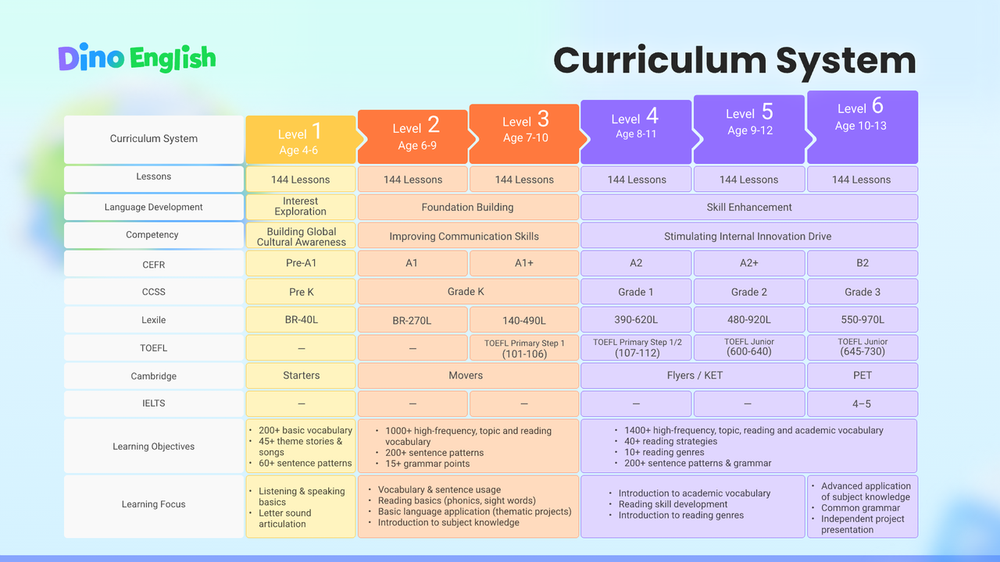

# Dino\_English\_VN\_Landing\_Page\_Design\_Brief

需求要求：

1\. 设计尽量体现与文案的逻辑，表达清楚文案的卖点以及传达优先级，不传递任何信息和目的的设计元素都不要，通过设计的手段，引导用户注意力对信息层优先级的阅读和吸收

2. 页面不要冗长，需要充分利用空间，高效体现信息，整体页面越短越好

3. 交互部分多做有利于转化的UI，比如抖动的按钮

4. 表单提交后，加上引导app下载的交互

**模块 1｜头图：先讲结果**

**Mô\-đun 1 \| Tiêu đề: Hãy nói về kết quả trước**

**主标题**

**tiêu đề chính**

Dino English （可以只放logo显示，不用文案占用空间）

让孩子追着学的英语课

Dino English \(bạn chỉ có thể hiển thị logo, không có copywriting chiếm dung lượng\)

Bài học tiếng Anh cho  em theo dõi

**副标题**

**Phụ đề**

- 孩子爱学，无压力开口，实时反馈

- 剧情\+游戏化激励\+IP陪伴\+高频互动

- 13年教研体系，个性化学习路径，进步清晰可见 

- 用 1/10 的价格，享受北美外教级教学质量

- 随时随地在家就能学

- Bé thích học, tự tin nói, phản hồi tức thì

- Câu chuyện, game hóa, IP đồng hành, tương tác cao

- 13 năm nghiên cứu, lộ trình riêng, tiến bộ rõ ràng

- Chất lượng giáo viên Bắc Mỹ, chỉ 1/10 giá

- Học mọi lúc, mọi nơi tại nhà

**品牌背书**

**Chứng thực thương hiệu**

「ETS LEXILE VIPKID 合作伙伴 」**（可以用tag形式表现）**

ĐỐI TÁC VIPKID ETS LEXILE \(có thể được thể hiện dưới dạng thẻ\)

**CTA **（按钮需要抖动效果）

**CTA **\(nút cần hiệu ứng phối màu\)

领取免费体验课

Nhận một lớp học dùng thử miễn phí

**模块 2｜卖点一：孩子愿意学，也敢开口说**

**Mô\-đun 2 \| Điểm bán hàng 1:  sẵn sàng học hỏi và dám lên tiếng**

**标题**

**tiêu đề**

**让孩子主动学，开口说**

**Hãy để  chủ động học hỏi và lên tiếng**

**卖点标签**

**nhãn điểm bán hàng**

- 故事剧情与游戏化激励，学习不枯燥

- 三种AI教师性格，孩子自主选择

- 高频互动，0压开口，建立自信

- IP 角色陪伴成长，让孩子愿意坚持

- Cốt truyện và động lực gamified, học không nhàm chán

- Ba nhân cách giáo viên AI,  em lựa chọn độc lập

- Tương tác tần số cao, mở áp suất 0, xây dựng sự tự tin

- Vai trò IP đồng hành cùng sự phát triển và khiến  sẵn sàng kiên trì

（设计元素可以包括卡通老师上课互动的视频，生动的卡通界面等）

\(Các yếu tố thiết kế có thể bao gồm video về các giáo viên hoạt hình tương tác trong lớp, giao diện hoạt hình sống động, v\.v\.\)

**模块 3｜卖点二：学习系统，进步可见**

**Mô\-đun 3 \| Điểm bán hàng 2: hệ thống học tập, tiến bộ rõ ràng**

**标题**

**tiêu đề**

**北美外教课程体系，为效果保驾护航**

**Hệ thống giáo viên nước ngoài ở Bắc Mỹ  hiệu ứng**

**卖点标签**

**nhãn điểm bán hàng**

- 国际标准 CEFR 课程体系

- 个性化学习路径， 进步清晰可见

- 在家学习，北美外教级质量

- 13 年180 万家庭验证过的好课

- Khung CEFR chuẩn quốc tế  

- Lộ trình riêng, tiến bộ rõ ràng  

- Học tại nhà, chuẩn giáo viên Bắc Mỹ  

- Khóa học được 1,8 triệu gia đình tin chọn suốt 13 năm

**模块 4｜为什么是 Dino English**

**Mô\-đun 4 \| Why Dino English**

**标题**

**tiêu đề**

**第一款真正教学的 AI 英语产品， 1/10 的价格享受北美外教质量**

**Sản phẩm AI tiếng Anh đầu tiên thực sự giảng dạy, chất lượng giáo viên Bắc Mỹ chỉ với 1/10 giá**

||真人一对一外教 Giáo viên bản ngữ 1:1|普通 AI 产品 AI thông thường|Dino English|
|---|---|---|---|
|效果 hiệu ứng|好老师难找，质量不一 Khó tìm giáo viên giỏi, chất lượng không đồng đều|内容零散，效果不明 Nội dung rời rạc, hiệu quả không rõ|CEFR体系课程，进步可见 CEFR, tiến bộ rõ ràng|
|互动 tương tác|预约上课，频次低 Cần đặt lịch, tần suất thấp|简单问答 Hỏi đáp đơn giản|随时互动，即时反馈 Tương tác mọi lúc, phản hồi tức thì|
|坚持 nhấn |靠家长督促 Cần cha mẹ nhắc nhở|缺少动力 Thiếu động lực|游戏化激励，IP 陪伴 Game hóa khích lệ, IP đồng hành|
|价格 giá cả|高 cao|杂乱 lộn xộn|外教级质量，1/10 价格 Chất lượng giáo viên bản ngữ, chỉ 1/10 giá|

**模块 5｜品牌介绍 **

**Mô\-đun 5 \| Giới thiệu thương hiệu**

**正文**

**văn bản**

Dino English 源自 VIPKID，是ETS 和 LEXILE官方合作伙伴。英语课程经过13年打磨、180万家庭验证，通过AI 技术和更适合孩子的互动体验结合起来，帮助更多孩子建立英语学习兴趣与表达自信。

\(可以放三个合作logo）

Dino English đến từ VIPKID, là đối tác chính thức của ETS và Lexile\. Với 13 năm kinh nghiệm và 1,8 triệu gia đình tin chọn, Dino English kết hợp chương trình tiếng Anh, AI và trải nghiệm tương tác, giúp bé yêu thích học tập và tự tin thể hiện\.

