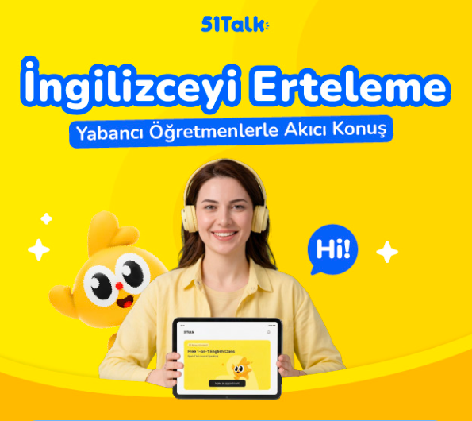
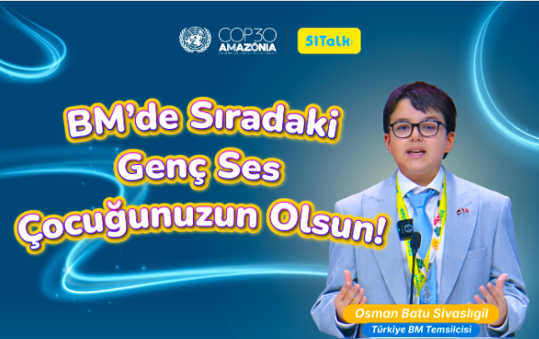
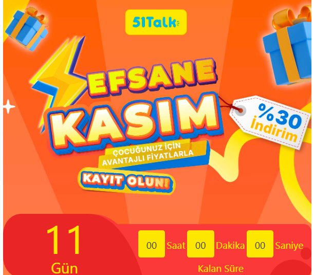
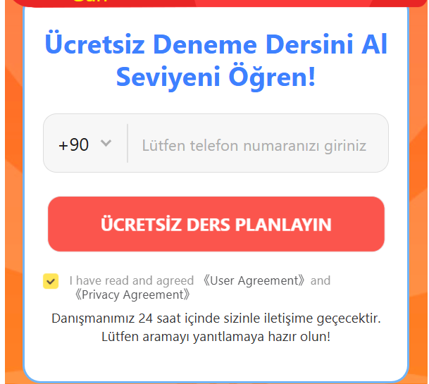
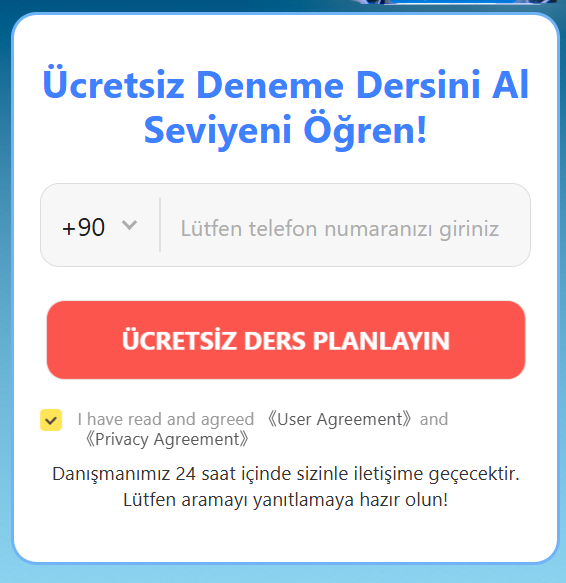
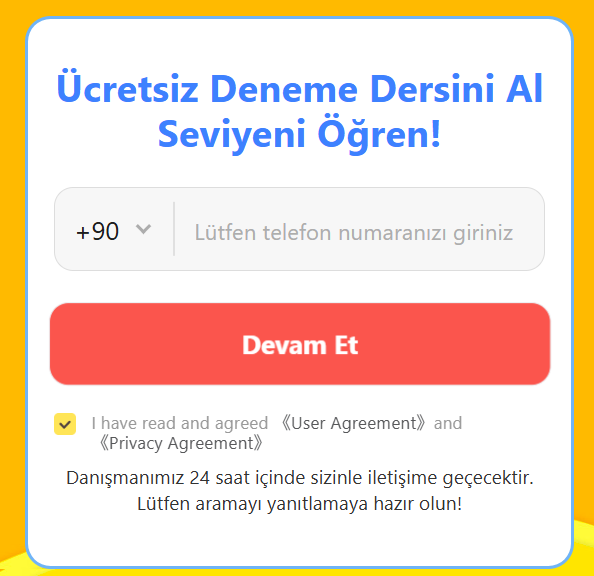

# Landing Page \- MY / ID

## Banner

Main tagline

**ENG: **Help Your Child Speak English with Confidence — 

Anytime, Anywhere with the most advanced AI companion\. 

Only RM 5 per class \(in a tag\)

**MY: **Bantu Anak Anda Bertutur Bahasa Inggeris dengan Yakin — Bila\-bila Masa, Di Mana Sahaja\.

Serendah RM5 Setiap Kelas \(in a tag\)

**ID: **Bantu Si Kecil Berani Bicara Bahasa Inggris — Kapan Saja, Di Mana Saja\.

Mulai dari RM5 per Kelas \(in a tag\)

Example

## Registration tab

Registration now to get your AI assessment report immediately

Below registration text: Your personalised course consultant will contact you within 24hours after registration

**After:  **

Main Copy: Get Your FREE AI English Assessment in 30 Seconds

CTA BUTTON: Get My FREE Assessment →

Below registration text: Our course consultant will contact you within 24 hours with your personalised learning recommendation and FREE trial activation\.

**MY: **

Main Copy: Dapatkan Penilaian AI Bahasa Inggeris PERCUMA Dalam 30 Saat

CTA BUTTON: Dapatkan Penilaian PERCUMA Saya →

Below registration text: Perunding pembelajaran kami akan hubungi anda dalam masa 24 jam untuk berkongsi cadangan pembelajaran dan mengaktifkan percubaan PERCUMA anda\.

**ID: **

Main Copy: Dapatkan Tes AI Bahasa Inggris GRATIS dalam 30 Detik

CTA BUTTON: Dapatkan Tes GRATIS Saya →

Below registration text: Konsultan belajar kami akan menghubungi Anda dalam 24 jam untuk memberikan rekomendasi belajar dan mengaktifkan trial GRATIS Anda\.

Example 

## Informative section

#### A\. Trusted by **1\.8 million families** over **13 years**

A 13\-year curriculum system used by 1\.8M families worldwide, fully CEFR\-aligned and matched to live\-teacher delivery; market\-validated quality, not experimental — refined over years for global children\.

Dino English 源自 VIPKID，是ETS 和 LEXILE官方合作伙伴。英语课程经过13年打磨、180万家庭验证，通过AI 技术和更适合孩子的互动体验结合起来，帮助更多孩子建立英语学习兴趣与表达自信。

**After:  **

Title: Trusted by 1\.8 Million Families Worldwide\. 
Sub\-title: Built on a proven curriculum refined over 13 years, fully aligned with CEFR and trusted by over 1\.8 million families worldwide\.

**MY: **

Title: Dipercayai Lebih 1\.8 Juta Keluarga\.
Sub\-title:Kurikulum yang dibangunkan selama 13 tahun, selaras dengan CEFR dan telah membantu lebih 1\.8 juta keluarga di seluruh dunia\.

**ID: **

Title: Dipercaya Lebih dari 1,8 Juta Keluarga\.
Sub\-title:Kurikulum yang dikembangkan selama 13 tahun, selaras dengan CEFR, dan sudah dipercaya lebih dari 1,8 juta keluarga di seluruh dunia\.

#### B\. Available to learn anytime

AI tutors are available 24/7, costing only 10% of real foreign teachers' price\.

**After:  **

Title: Learn Anytime with Your AI Tutor
Sub\-title: Available 24/7, giving your child unlimited speaking practice at only 10% of the cost of a traditional foreign teacher\.

**MY: **

Title: Belajar Bila\-bila Masa dengan Tutor AI
Sub\-title: Tutor AI tersedia 24/7, membolehkan anak anda berlatih bercakap tanpa had pada hanya 10% daripada kos guru asing sebenar\.

**ID: **

Title: Belajar Kapan Saja dengan Tutor AI
Sub\-title: Tutor AI tersedia 24/7, jadi anak bisa latihan berbicara kapan saja dengan biaya hanya 10% dari guru asing\.

#### C\. Designed under CERF course structure and North America academic standards

Aligned with the CEFR \(Common European Framework of Reference for Languages\), covering all levels from Pre\-A1 to B1\.  Designed for learners aged 4–13, featuring a gradually progressing and clearly defined ability placement\.

**After:  **

Title: A Structured Learning Path That Grows With Your Child
Sub\-title: Following the internationally recognised CEFR framework, every lesson is tailored to your child's level, from Pre\-A1 to B1, ensuring clear and measurable progress\.

**MY: **

Title: Laluan Pembelajaran Yang Berkembang Bersama Anak Anda
Sub\-title: Mengikut piawaian CEFR yang diiktiraf di seluruh dunia, setiap pelajaran disesuaikan mengikut tahap anak anda, daripada Pre\-A1 hingga B1, dengan kemajuan yang jelas\.

**ID: **

Title: Jalur Belajar yang Tumbuh Bersama Si Kecil
Sub\-title: Mengikuti standar CEFR yang diakui secara internasional, setiap pelajaran disesuaikan dengan level anak, dari Pre\-A1 hingga B1, sehingga kemajuannya jelas terlihat\.

#### D\. Latest AI\-powered technology of product

The industry's only multi\-language large model, supporting multilingual interaction in Chinese, English, Malay, Arabic, etc\., capable of accurately adapting to the learning habits and mother tongue interference points of users in different countries\. 

**After:  **

Title: Powered by the World's Most Advanced Multilingual AI
Sub\-title: Understands English, Chinese, Malay, Arabic and more, adapting naturally to your child's language background for a more personalised learning experience\.

**MY: **

Title: Dikuasakan oleh AI Pelbagai Bahasa yang Paling Canggih
Sub\-title: Memahami Bahasa Inggeris, Cina, Melayu, Arab dan banyak lagi, lalu menyesuaikan pembelajaran mengikut bahasa pertama anak anda untuk pengalaman yang lebih peribadi\.

**ID: **

Title: Didukung AI Multibahasa Tercanggih
Sub\-title: Memahami Bahasa Inggris, Mandarin, Melayu, Arab, dan lainnya, sehingga bisa menyesuaikan cara belajar sesuai bahasa ibu anak untuk pengalaman belajar yang lebih personal\.

